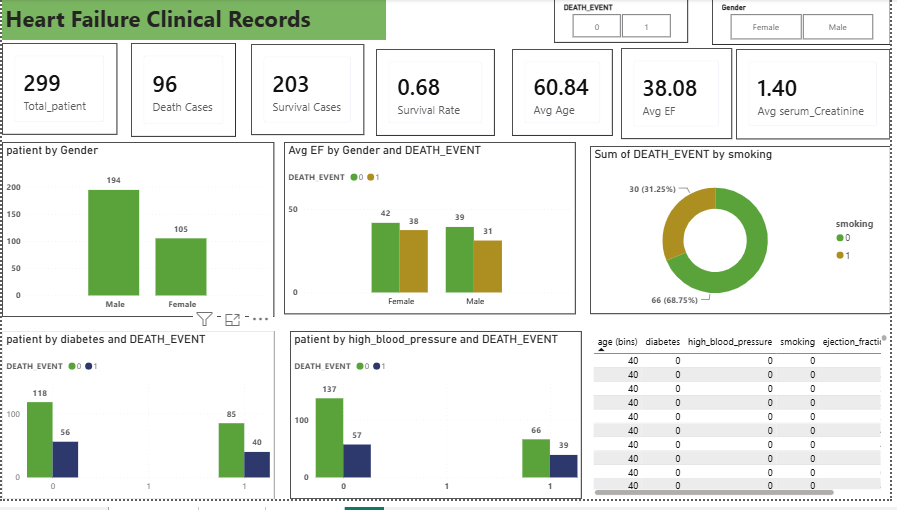
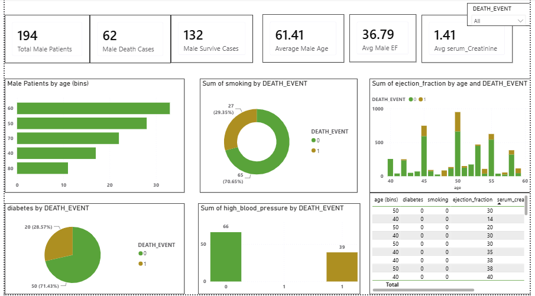
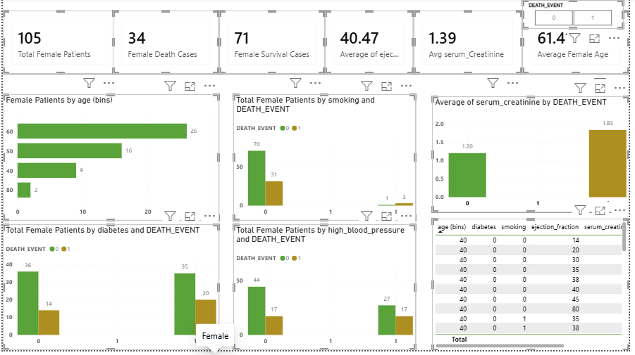

# ❤️ Heart Failure Clinical Records Analysis

## 📌 Project Overview

This project analyzes the **Heart Failure Clinical Records** dataset using **Python** for data cleaning and exploratory data analysis (EDA), and **Power BI** for creating an interactive dashboard. The objective is to identify factors associated with heart failure, compare survival and death cases, and present healthcare insights through interactive visualizations.

---

## 🎯 Objectives

* Analyze heart failure patient data.
* Identify factors associated with patient survival and death.
* Compare male and female patient statistics.
* Build an interactive Power BI dashboard.
* Generate meaningful healthcare insights for data-driven decision making.

---

## 📂 Dataset Information

**Dataset:** Heart Failure Clinical Records

### Dataset Features

* Age
* Gender
* Anaemia
* Diabetes
* High Blood Pressure
* Smoking
* Ejection Fraction
* Serum Creatinine
* Serum Sodium
* Platelets
* Time
* Death Event 

---

### Python Libraries

* Pandas
* NumPy
* Matplotlib
* Seaborn

# 🐍 Python Analysis

### Data Cleaning

* Checked missing values
* Verified duplicate records
* Corrected data types
* Prepared the dataset for analysis

### Exploratory Data Analysis (EDA)

* Age Distribution
* Gender Distribution
* Death Event Analysis
* Scatter Plot
* Diebetes
* Smoking
* High Blood Pressure

# 📈 Key Insights

Dataset contains 299 heart failure patients.
Majority of patients are male.
Older patients show a higher mortality rate.
Patients with lower ejection fraction have a higher risk of death.
High serum creatinine is associated with increased mortality.
Diabetes and high blood pressure are common among patients.
Smoking is observed in a smaller portion of patients compared to non-smokers.

---

# 📊 Power BI Dashboard

The dashboard is divided into **three interactive pages**.

# 🛠 Tools 

* Power BI
* DAX
* Power Query

# 📷 Dashboard Preview

### Overview Dashboard

### Male Patients Dashboard

### Female Patients Dashboard

# 📈 Key Insights

* Older patients showed a higher risk of heart failure.
* Lower ejection fraction was associated with increased mortality.
* Patients with high serum creatinine had a greater risk of death.
* Diabetes and high blood pressure were common among heart failure patients.
* Gender-wise analysis helps compare survival and mortality patterns.
* Interactive filters make it easier to explore patient groups

---

# 🚀 Conclusion

This project demonstrates how Python and Power BI can be combined to perform healthcare data analysis. Python was used for data cleaning and exploratory analysis, while Power BI was used to develop an interactive dashboard with dedicated Overview, Male, and Female analysis pages. The project highlights practical skills in data preprocessing, visualization, and business intelligence.

---

## 👩‍💻 Author

**Shalini Satikosre**

**Aspiring Data Analyst**

**Skills:** SQL | Python | Power BI | Excel | GitHub

